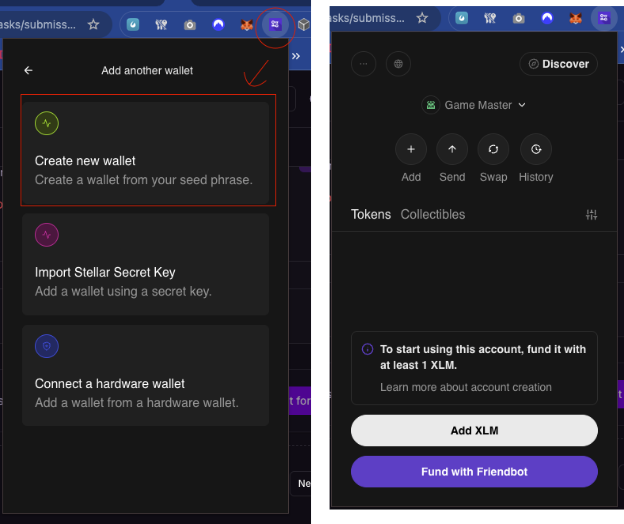
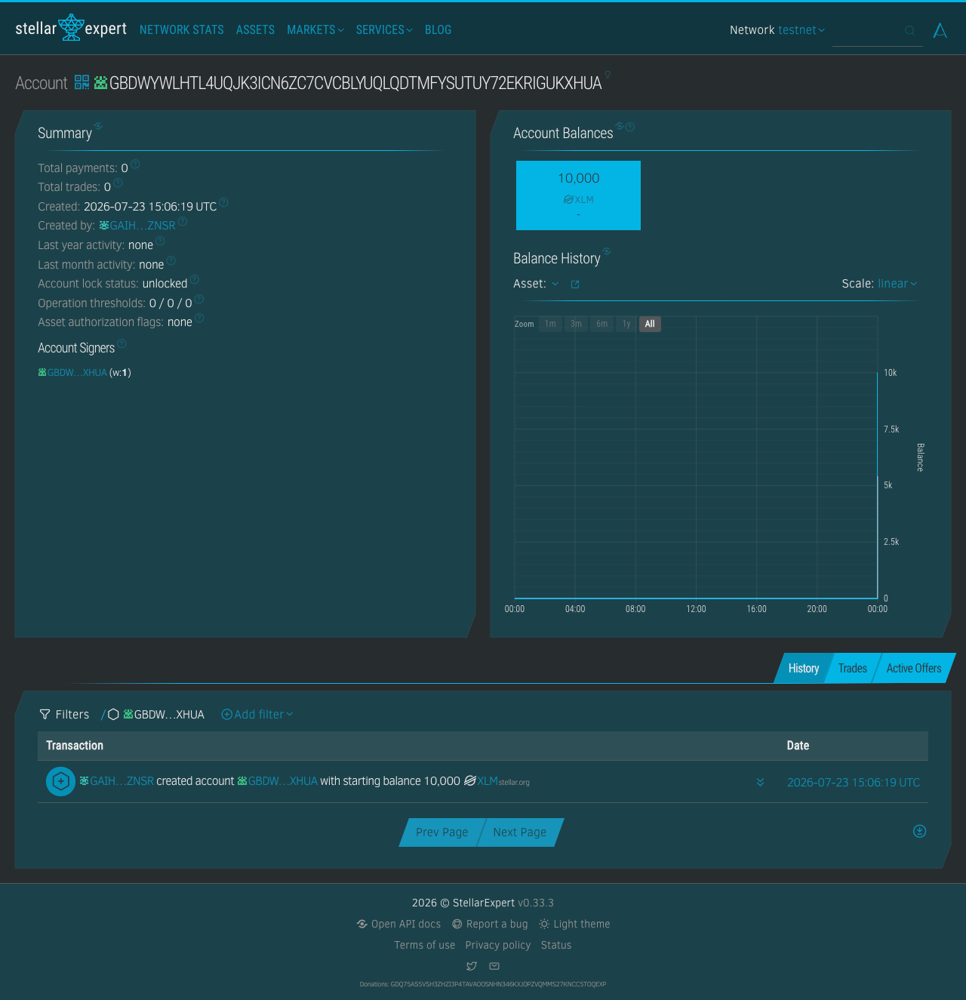
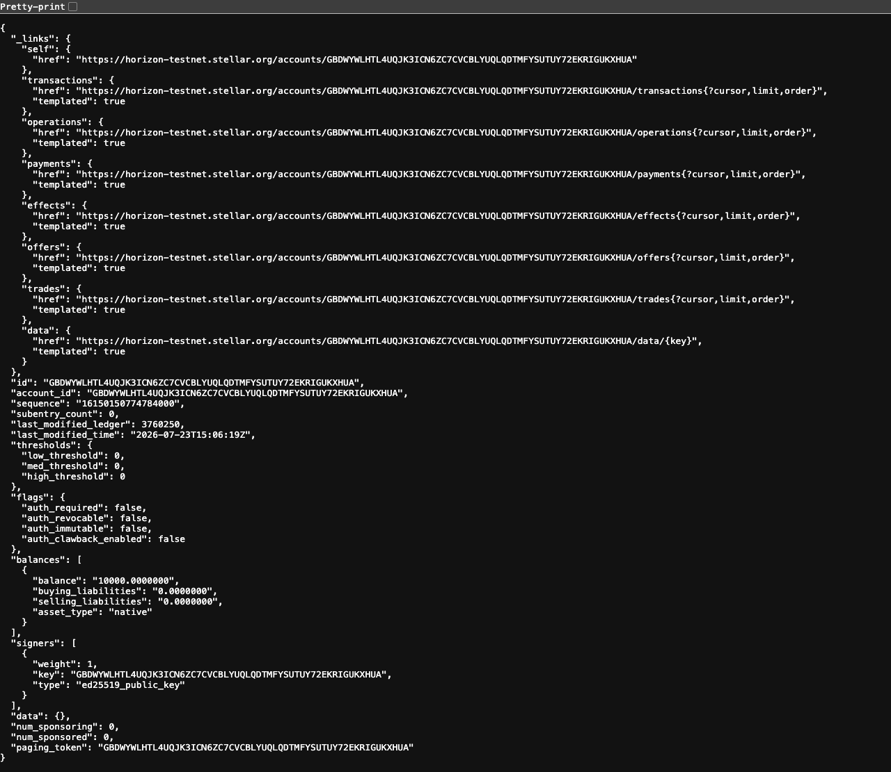
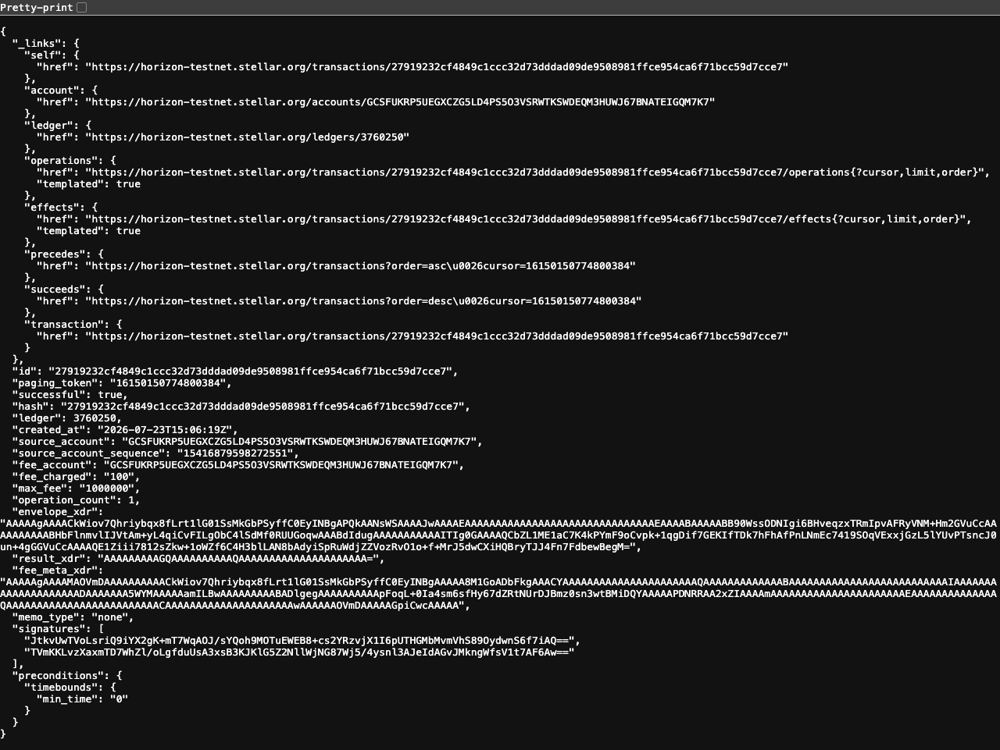

# TreasureNet

**A Stellar-powered wallet application for the Stellar Journey to Mastery - Level 1 White Belt.**

Connect your Freighter wallet, view your testnet balance, and send XLM transactions on the Stellar testnet.

## Requirements Checklist

- [x] Freighter wallet connection
- [x] Wallet disconnect functionality
- [x] Fetch and display XLM balance from Horizon
- [x] Send XLM transaction on Stellar testnet
- [x] Transaction success/failure feedback with hash
- [x] Link to Stellar Expert explorer

## Screenshots

### Wallet Connected State



_Freighter wallet connected with green indicator._

### Balance Displayed



_Live testnet XLM balance fetched from Horizon API._

### Successful Testnet Transaction



_Transaction submitted successfully with hash and explorer link._

### Transaction Result



_Transaction hash, status, and link to Stellar Expert explorer._

## Setup Instructions

### Prerequisites

- [Freighter Wallet](https://freighter.app) browser extension
- Node.js >= 20
- pnpm (`npm install -g pnpm`)

### Run Locally

```bash
git clone https://github.com/greenarmor/treasurenet.git
cd treasurenet
pnpm install
pnpm dev
```

Open <http://localhost:3000/wallet>

### Test the Wallet

1. Open <http://localhost:3000/wallet>
2. Click "Connect Freighter Wallet"
3. Ensure Freighter is set to **Testnet**
4. Fund your wallet at <https://laboratory.stellar.org/#account-creator>
5. Your balance will appear
6. Send a test transaction to any testnet address
7. View the result and explorer link

## Tech Stack

- **Frontend**: Next.js + React + Tailwind CSS
- **Wallet**: Freighter browser extension
- **Stellar SDK**: @stellar/stellar-sdk
- **Network**: Stellar Testnet (Horizon API)
